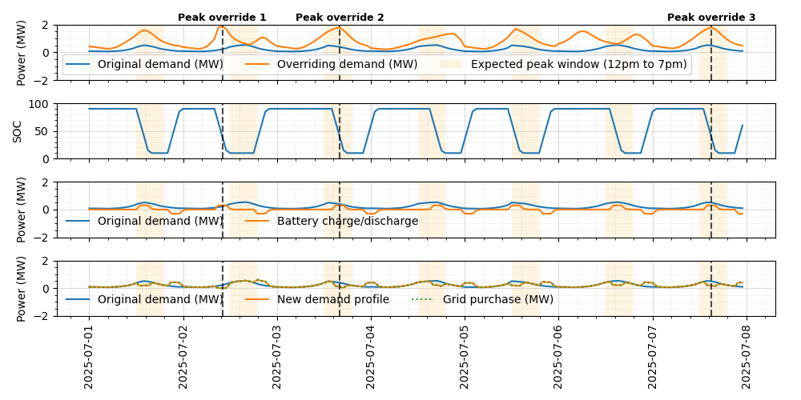

(open-loop-control)=
# Open-Loop Controllers

## Open-Loop Storage Controllers
The open-loop storage controllers can be attached as the control strategy in the `tech_config` for various storage components (e.g., battery or hydrogen storage). There are three controller types for storage:
1. [Simple Open-Loop Storage Controller](#pass-through-controller) — passes the commodity flow to the output with only minimal or no modifications.
2. [Demand Open-Loop Storage Controller](#demand-open-loop-storage-controller) — uses simple logic to attempt to meet demand using the storage technology.
3. [Peak Load Management Open-Loop Storage Controller](#peak-load-management-open-loop-storage-controller) — computes a peak-shaving dispatch schedule to reduce demand peaks, supporting one or two demand profiles with configurable event limits and time windows.

(pass-through-controller)=
### Simple Open-Loop Storage Controller
The `SimpleStorageOpenLoopController` passes the input commodity flow to the output, possibly with minor adjustments to meet demand. It is useful for testing and as a placeholder for more complex controllers.

For examples of how to use the `SimpleStorageOpenLoopController` open-loop control framework, see the following:
- `examples/01_onshore_steel_mn`
- `examples/02_texas_ammonia`
- `examples/12_ammonia_synloop`

(demand-open-loop-storage-controller)=
### Demand Open-Loop Storage Controller
The `DemandOpenLoopStorageController` uses simple logic to dispatch the storage technology when demand is higher than commodity generation and charges the storage technology when the commodity generation exceeds demand, both cases depending on the storage technology's state of charge. For the `DemandOpenLoopStorageController`, the storage state of charge is an estimate in the control logic and is not informed in any way by the storage technology performance model.

An example of an N2 diagram for a system using the open-loop control framework for hydrogen storage and dispatch is shown below ([click here for an interactive version](./figures/open-loop-n2.html)). Note that the hydrogen out going into the finance model is coming from the control component.


For examples of how to use the `DemandOpenLoopStorageController` open-loop control framework, see the following:
- `examples/14_wind_hydrogen_dispatch/`
- `examples/19_simple_dispatch/`

(peak-load-management-open-loop-storage-controller)=
### Peak Load Management Open-Loop Storage Controller
The `PeakLoadManagementHeuristicOpenLoopStorageController` computes and executes a peak-shaving dispatch schedule assuming perfect forecasting. It is designed for reducing peak loads, not meeting a specific demand, using either one or two loads for determining peaks.

```{note}
The algorithm currently only supports daily cycles, but could be adjusted to accommodate alternate cycle rates.
```

The controller supports two demand profiles:

- **`demand_profile`** — the local or sub-system demand. Peaks within a configurable daily time window (`peak_range`) are identified as candidate discharge targets.
- **`demand_profile_upstream`** — an optional upstream or supervisory demand. When provided, an operator can override the local peak schedule up to a configurable number of events per period (e.g., three times per week). Peaks are determined as the highest n peaks in each period.

The `dispatch_priority_demand_profile` parameter selects which profile acts as the override schedule. On days where the priority profile flags a peak (up to n override instances in the given time period), the controller follows that schedule; on all other days it falls back to the other profile.

**Dispatch logic (state machine)**

1. **Discharge** — begins `advance_discharge_period` before the next scheduled peak and runs until `min_soc_fraction` is reached.
2. **Charge** — resumes after `delay_charge_period` has elapsed since the end of discharge, subject to the `allow_charge_in_peak_range` flag which can block recharging during the peak windows.
3. **Idle** — all other timesteps; set-point is zero.

An example output for the first week of a one-year simulation is shown below. Orange shading marks the 12:00–19:00 daily peak window. The top panel shows both demand profiles; the second panel shows battery state of charge; the third shows battery charge/discharge power; the fourth shows the resulting net demand. Periods where `demand_profile_upstream` takes precedence are marked with vertical dashed lines (three occurrences in the week shown). Note that where `demand_profile_upstream` does not override, the peaks in `demand_profile` are reduced.



For an example of how to use the `PeakLoadManagementHeuristicOpenLoopStorageController`, see:
- `examples/33_peak_load_management/`

For API details, see the [`PeakLoadManagementHeuristicOpenLoopStorageController` API documentation](../_autosummary/h2integrate.control.control_strategies.storage.plm_openloop_storage_controller).
